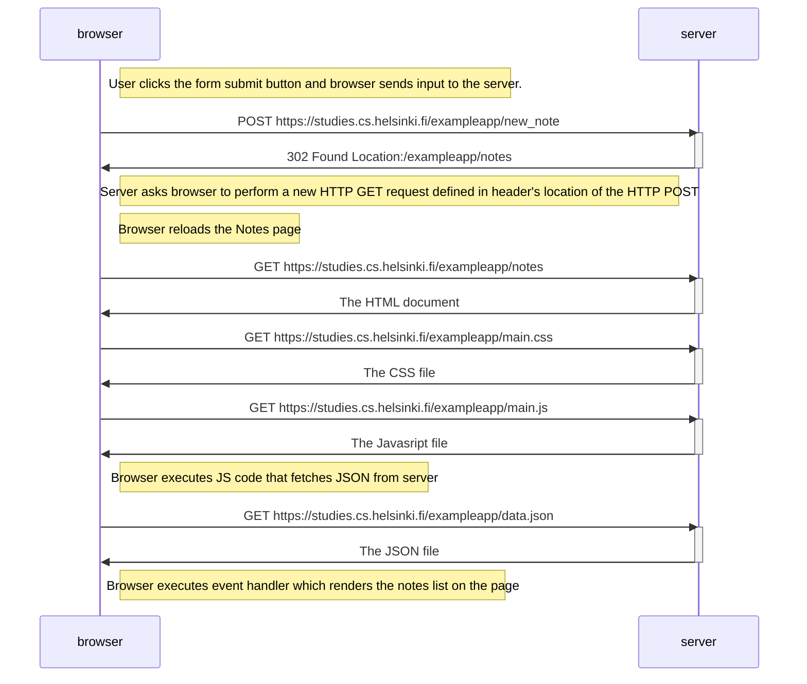

```mermaid
sequenceDiagram
participant browser
participant server

    Note right of browser: User clicks the form submit button and browser sends input to the server.
    browser->>server: POST https://studies.cs.helsinki.fi/exampleapp/new_note
    activate server
    server->>browser: 302 Found Location:/exampleapp/notes
    deactivate server

    Note left of server: Server asks browser to perform a new HTTP GET request defined in header's location of the HTTP POST

    Note right of browser: Browser reloads the Notes page
    browser->>server: GET https://studies.cs.helsinki.fi/exampleapp/notes
    activate server
    server->>browser: The HTML document
    deactivate server

    browser->>server: GET https://studies.cs.helsinki.fi/exampleapp/main.css
    activate server
    server->>browser: The CSS file
    deactivate server

    browser->>server: GET https://studies.cs.helsinki.fi/exampleapp/main.js
    activate server
    server->>browser: The Javasript file
    deactivate server

    Note right of browser: Browser executes JS code that fetches JSON from server
    browser->>server: GET https://studies.cs.helsinki.fi/exampleapp/data.json
    activate server
    server->>browser: The JSON file
    deactivate server

    Note right of browser: Browser executes event handler which renders the notes list on the page
```
