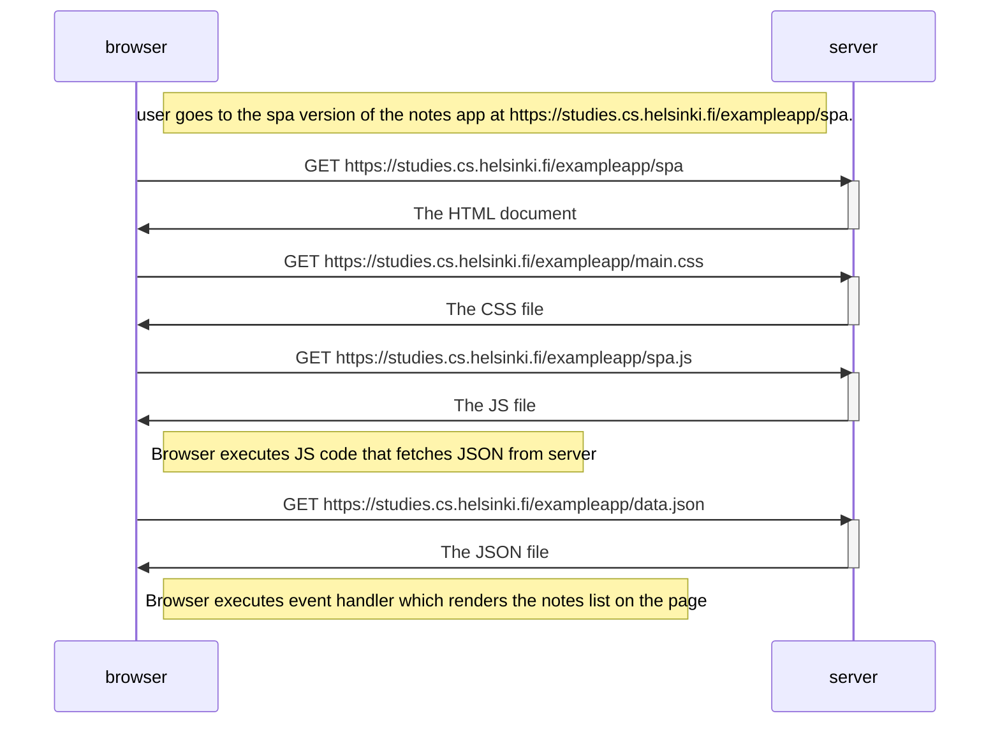

```mermaid
sequenceDiagram
participant browser
participant server
    Note right of browser: user goes to the spa version of the notes app at https://studies.cs.helsinki.fi/exampleapp/spa.

    browser->>server: GET https://studies.cs.helsinki.fi/exampleapp/spa
    activate server
    server->>browser: The HTML document
    deactivate server

    browser->>server: GET https://studies.cs.helsinki.fi/exampleapp/main.css
    activate server
    server->>browser: The CSS file
    deactivate server

    browser->>server: GET https://studies.cs.helsinki.fi/exampleapp/spa.js
    activate server
    server->>browser: The JS file
    deactivate server

    Note right of browser: Browser executes JS code that fetches JSON from server

    browser->>server: GET https://studies.cs.helsinki.fi/exampleapp/data.json
    activate server
    server->>browser: The JSON file
    deactivate server

    Note right of browser: Browser executes event handler which renders the notes list on the page
```
