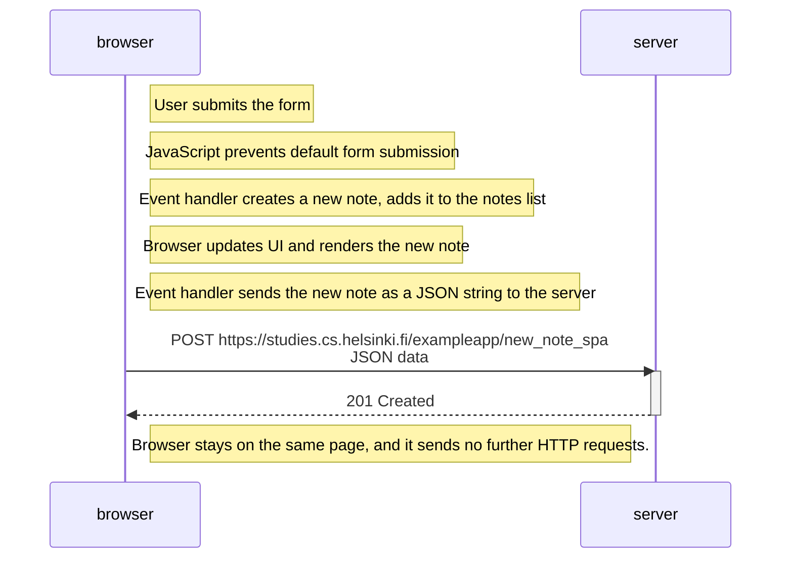

```mermaid
sequenceDiagram
participant browser
participant server

    Note right of browser: User submits the form
    Note right of browser:  JavaScript prevents default form submission
    Note right of browser:  Event handler creates a new note, adds it to the notes list
    Note right of browser:  Browser updates UI and renders the new note
    Note right of browser:  Event handler sends the new note as a JSON string to the server

    browser->>server: POST https://studies.cs.helsinki.fi/exampleapp/new_note_spa<br/>JSON data
    activate server
    server-->>browser: 201 Created
    deactivate server

    Note right of browser: Browser stays on the same page, and it sends no further HTTP requests.

```
